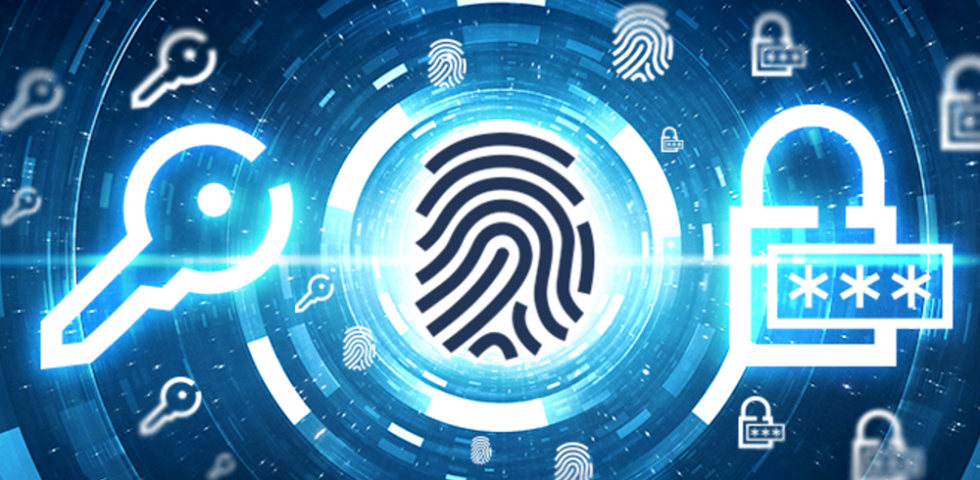

<p align="center">
  <a href="" rel="noopener">
 </a>
</p>

# Autentiticación y gestion de usuarios
<div align="center">


</div>

## Table of Contents

- [About](#about)
- [Getting Started](#getting_started)
- [Usage](#usage)
- [Contributing](../CONTRIBUTING.md)

## About <a name = "about"></a>

Sistema de autenticación y gestión de ususario.

## Getting Started <a name = "getting_started"></a>

### Prerequisites

- Install NPM
- MongoDB

### Installing

```bash
# CREATE DATA FOLDER PARA LA COMUNICACÓN ENTRE NODEJS Y PYTHON
$ mkdir ../data

# CLONAR REPOSITORIO
$ git clone https://github.com/Geronimo-montes/biometric_recognition

# INSTALAR DEPENDENCIAS
$ npm install
$ npm install --dev

# INSTALL REQUIREMENTS
$ pip install -r requirements.txt
```
## Usage <a name = "usage"></a>

Correr el proyecto
``` bash
$ npm start
```